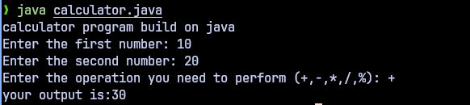

Java Console Calculator

Description:

A simple console-based calculator built in Java to perform basic arithmetic operations (addition, subtraction, multiplication, division). 
This project demonstrates core Java concepts like variables, control flow, methods, and exception handling.
Developed using Neovim with JDTLS.

Features:

Accepts two numbers and an operator (+, -, *, /) via user input.
Performs arithmetic calculations and displays the result.
Handles errors like division by zero using try-catch.
Clean, modular code with methods for operations.

Prerequisites:

Java Development Kit (JDK) 17 or later installed.
A terminal to run the program.

Project Structure:

src/Calculator.java: Main Java file with calculator logic.
Resource/:images of output
README.md: Project documentation.

Output:

